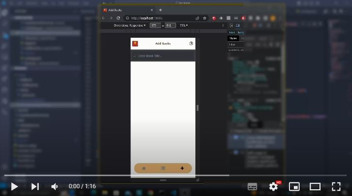
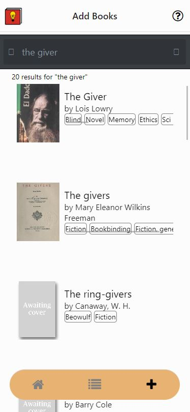
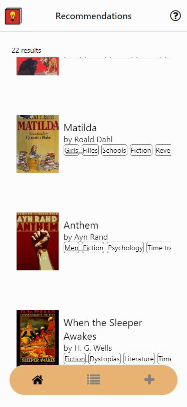
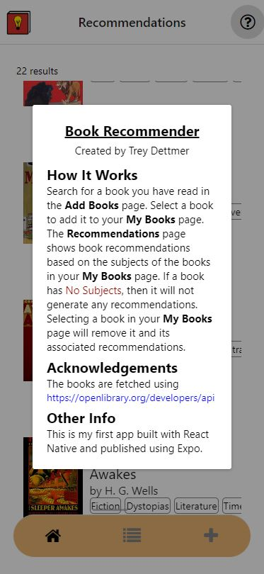

# Book Recommender 
## Get book recommendations based off the books you love!
### Try it at: https://expo.dev/@treydettmer/book-recommender (requires a free Expo account)

### Video Demo

## About
I made this app in a week to familiarize myself with the React Native framework. I have had previous experience with ReactJS ([check it out](https://github.com/TreyDettmer/Charade-Word-Games)) so the learning curve of React Native was not bad. The app uses the [OpenLibrary Search API](https://openlibrary.org/dev/docs/api/search) to find books. The API allows developers to query a database of books using a list of OR separated book subjects. In this app, each book in a user's library triggers an API request with that indivudal book's subjects as the query. The results (recommendations) from this query are displayed in the Recommendations page of the app and are shuffled with the other books' recommendations.

## Challenges
The major challenge of this app was figuring out how to find recommendations for a given book. Unlike Amazon or other bookstore websites, there is no user data which could be used to recommend books that other users with the same taste have read. The best option I found was to use the subjects associated with each book as a way to find similar books. This required some filtering since certain books have a ton of subjects (e.g. 77+) which wouldn't be able to fit into a query to the API. The filtering I did was ignoring the subject names that had more than two words or had non English characters. This trimmed down the number of subjects for each book while still retaining the important information. Unfortunately, not all books have subjects to use or covers to display. There is also the issue of the subtitles of the books not being displayed. The lack of subtitles is the result of the search API not including them in the response. They could be acquired using the [OpenLibrary Editions API](https://openlibrary.org/dev/docs/api/books) but this would require multiple API calls for each book (one call for each edition) to get the subtitles of each edition. This was not within the scope the project and it seemed like it wouldn't be good for the app's performance.

## Screenshots

